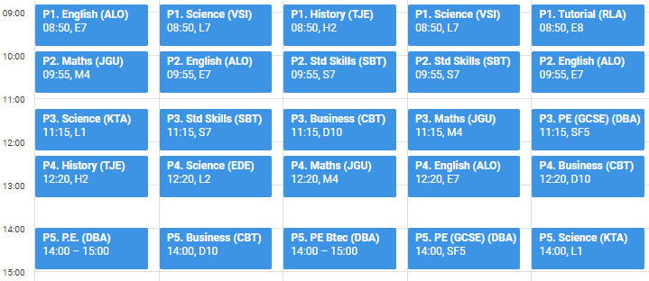

# Timetable Calendar Generator :calendar:

This is a cross-platform command line tool for bulk generating student and teacher timetables. It can create calendar files in comma-separated (.csv) or iCal (.ics) format, or upload directly to Google Calendar.



### Usage

1. Ensure you have the [.NET Core 2.1 runtime](https://www.microsoft.com/net/download/core#/runtime) installed.
1. Download the latest ZIP package from our [Releases page](https://github.com/jamesgurung/timetable-calendar-generator/releases) and extract the contents.
1. In the "inputs" directory, add the input files defined below.
1. Open a command line and run one of the following commands:
    1. `dotnet makecal.dll --csv` to generate comma-separated (.csv) calendar files
    1. `dotnet makecal.dll --ical` to generate iCalendar (.ics) files
    1. `dotnet makecal.dll --google` to directly upload users' timetables to Google Calendar (this requires domain admin privileges)

### Input files

#### settings.json

Configure lesson timings, study leave dates and periods to override for all users.

```
{
  "lessonTimes":
  [
    { "startTime": "08:50", "duration": 60 },
    { "startTime": "09:55", "duration": 60 },
    { "startTime": "11:15", "duration": 60 },
    { "startTime": "12:20", "duration": 60 },
    { "startTime": "14:00", "duration": 60 },
    { "startTime": "15:05", "duration": 60 }
  ],
  "studyLeave":
  [
    { "year": 11, "startDate": "04-Jun-18", endDate: "20-Jul-18" },
    { "year": 12, "startDate": "11-May-18", endDate: "10-Jun-18" },
    { "year": 13, "startDate": "25-May-18", endDate: "20-Jul-18" }
  ],
  "overrides":
  [
    { "date": "07-Sep-17", "period": 1, "title": "Tutorial" },
    { "date": "20-Dec-17", "period": 3, "title": "Whole school assembly" },
    { "date": "20-Dec-17", "period": 4, "title": "" },
    { "date": "20-Dec-17", "period": 5, "title": "" }
  ],
  "renames":
  [
    { "originalTitle": "PPA", "newTitle": "" }
  ]
}

```

#### days.csv

Each teaching day in the school year, in `dd-MMM-yy` format, followed by a numerical week indicator (i.e. Week 1 or Week 2). Non-teaching days such as weekends and holidays should be omitted. This file can be created in a spreadsheet app.

```
06-Sep-17,1
07-Sep-17,1
08-Sep-17,1
11-Sep-17,2
...
```

#### students.csv

This can be run as a spreadsheet report from your MIS and then exported to CSV. Periods must be in the format `1Mon:2` (meaning Week 1 Monday Period 2). Whitespace not required.

```
Email               , Year , Subject  , Period , Room , Teacher
student1@school.org , 10   , Business , 1Mon:3 , D5   , JGO
                    ,      ,          , 1Tue:5 , D5   , JGO
                    ,      ,          , 1Thu:1 , D5   , JGO
                    ,      , English  , 1Thu:3 , E1   , CST
                    ,      ,          , 2Thu:3 , E1   , CST
student2@school.org , 11   , P.E.     , 1Tue:3 ,      , DBA
...
```
SIMS users can download the report [SIMS-StudentTimetables.RptDef](resources/SIMS-StudentTimetables.RptDef).

#### teachers.csv

This takes a different format. There is a column for each period in the timetable, and two rows for each teacher: the first containing class codes, and the second containing room numbers. Whitespace not required.

```
Email               , 1Mon:1   , 1Mon:2   , 1Mon:3   , ...
teacher1@school.org , 10B/Ar1  , 13A/Ar1  , 9A/Ar1   , ...
                    , O3       , O6       , O3       , ...
teacher2@school.org ,          , 10ab/Ma4 , 8a/Ma3   , ...
                    ,          , M4       , M4       , ...
...
```
To create this file in SIMS:

1. Click Reports -> Timetables -> All Staff Timetable.
1. Choose an Effective Date and click OK.
1. Click the "Flip" button in the top-left corner. Teacher names should now appear going down the page.
1. On the far right of the screen, click the button for "Show/Hide Cell Settings".
1. At the bottom of the Cell Settings pane, set "Number of Rows" to 2.
1. In the middle of the pane, there is a split box which says "ClassRM" in the top half. Click and drag the "RM" part into the lower half of that box.
1. Back at the top-left of the screen, click "Export".
1. Change "HTML" to "Excel" and click OK.
1. When the spreadsheet opens, delete rows 1-4 which contain the title.
1. Replace staff names in the left-hand column with their email addresses. You may be able to do this with a `VLOOKUP` formula.
1. Save as `teachers.csv`


#### key.json

If you are using the `--google` flag to directly upload timetables to Google Calendar, you will need to create a free service account key:

1. [Create a new project](https://console.cloud.google.com/projectcreate) on the Google Cloud Platform console.
1. [Enable the Google Calendar API.](https://console.cloud.google.com/apis/api/calendar-json.googleapis.com/overview) Depending on the size of your school, you may also need to apply for a raised quota. The tool may use up to 1000 API requests per user when it is first run.
1. [Create a new service account.](https://console.cloud.google.com/apis/credentials/serviceaccountkey) Give it any name and set the role to "Project - Editor". Select "Furnish a new private key (JSON)" and "Enable G Suite Domain-wide Delegation". Set the product name to "Timetable Calendar Generator" and click "Create".
1. The service account's private key will be downloaded to your computer. Rename it to `key.json` and put it in the `inputs` folder.
1. Now delegate domain-wide authority to this service account:
    1. On the Service Accounts overview page, click "View Client ID" and copy the long ID number.
    1. Open your G Suite domain control panel and click on the "Security" icon. This can sometimes be found in the "More controls" option.
    1. Go to Advanced settings > Authentication > Manage OAuth client access.
    1. In the "Client Name" field enter the service account's Client ID which you copied earlier.
    1. In the "One or More API Scopes" field enter `https://www.googleapis.com/auth/calendar`
    1. Click the Authorize button.


### Output

The output depends on which flag was set:

#### `--csv` or `--ical`
The tool creates a "calendars" folder containing a CSV or ICS calendar file for each user. These files can be shared along with [instructions for importing to Google Calendar](import-tutorial.md).

#### `--google`
The tool creates a new "My timetable" calendar for each user, and fills this with their lessons for the remainder of the year. If the "My timetable" calendar already exists, all modified future events are cleared and replaced with new events.

### Contributing

Issues and pull requests are welcome.
