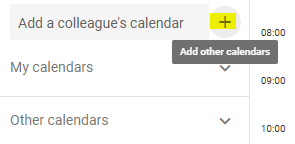
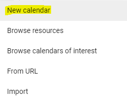
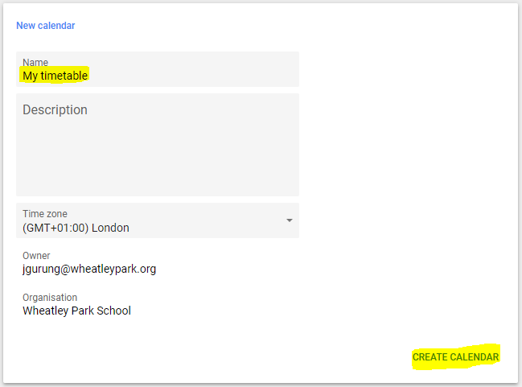
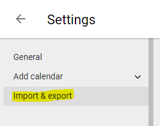
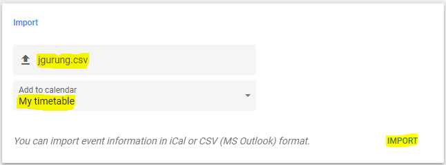

# Importing your timetable to Google Calendar

1. Open [Google Calendar](https://calendar.google.com/calendar/r).
2. Click the "+" button and select "New calendar".

>  

3. Set the name to "My timetable" and create the calendar.
> 

4. Now towards the top of the screen, click the "Import & export" button.

> 

5. Browse to the CSV or ICS file that has been shared with you. Make sure you import the file to your new "My timetable" calendar.

> 

6. Your timetable should appear after a few moments.

> 
