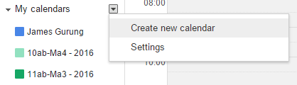
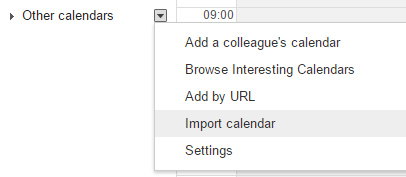
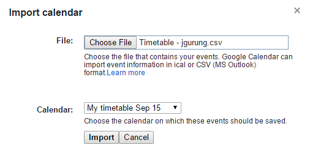
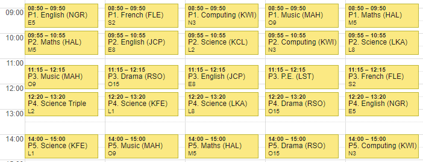

# Importing your timetable to Google Calendar

1. Open [Google Calendar](https://calendar.google.com)
2. Create a new calendar called "My timetable"

> 

3. Back on Google Calendar, click the arrow next to "Other calendars" and select "Import calendar"

> 

4. Browse to the CSV file that has been shared with you. Make sure you import the file to your new "My timetable" calendar.

> 

5. Your timetable should appear after a few moments.

> 
